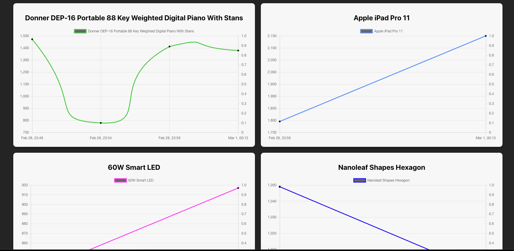

# Web Scraping Price Tracker

This project is a web scraping application that collects product prices from **BestBuy** and **AliExpress** and visualizes the price history through interactive charts.

⚠️ Note: The project is deployed in a free workspace, so it may take a little longer to load when accessed for the first time.

## 🛠️ Tech Stack

### Backend:

- **Node.js** (v22) with **TypeScript**
- **Fastify** for high-performance API handling
- **Puppeteer** for web scraping
- **PostgreSQL** for database storage

### Frontend:

- **React** with **TypeScript**
- **react-chartjs-2** for data visualization

## 🚀 Features

- Scrapes product prices from **BestBuy** and **AliExpress**
- Stores historical price data in **PostgreSQL**
- Provides a RESTful API using **Fastify**
- Displays price trends in **interactive charts**
- Automated scraping using node-cron to fetch updated prices periodically

## 🔗 Live Demo

[Web Application](https://price-trakcer.vercel.app/)

## 📸 Screenshots

### Price History Graph

Developed by **Gabriel Rabelo** 🚀

